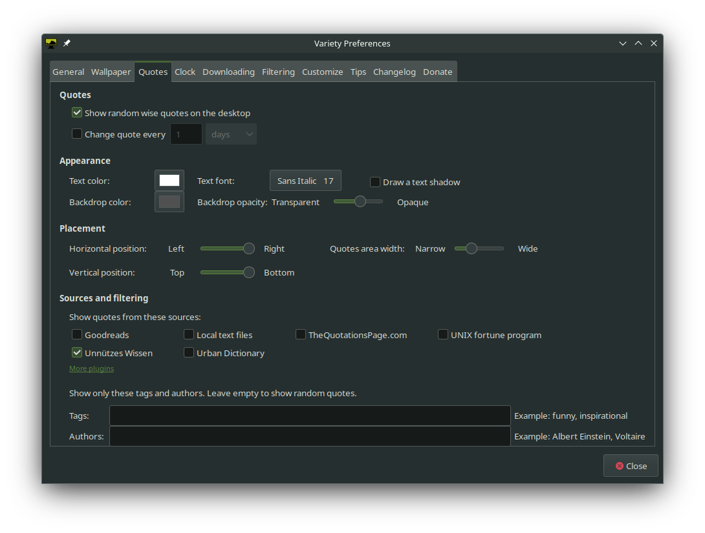

# Unnützes Wissen für Variety

Ein Plugin für [Variety](https://github.com/varietywalls/variety), welches unnütze Fakten anzeigt.

Die unnützen Fakten stammen von (https://uselessfacts.jsph.pl/).

Getestet mit Variety 0.8.9

## Installation

1. Lade die Datei`unnuetzes-wissen.py` herunter
2. Verschiebe sie in den Ordner `~/.config/variety/plugins`
3. Starte Variety neu

## Verwendung

Um das Plugin zu aktivieren, öffne das **Variety Preferences** Fenster. Navigiere zum **Quotes** tab. Wähle im Abschnitt **Sources and filtering** die Checkbox für **Unnützes Wissen** an.

Dieses Plugin unterstützt keine Filterung nach Autoren.
